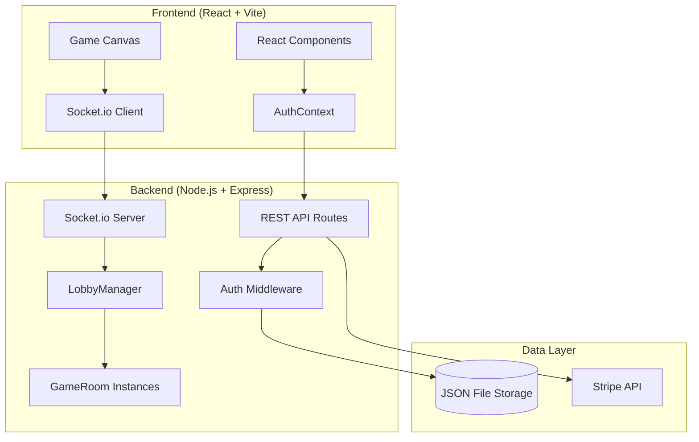
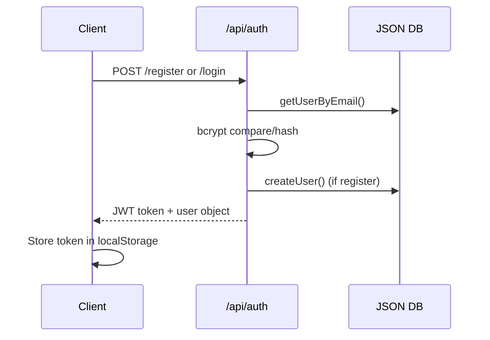
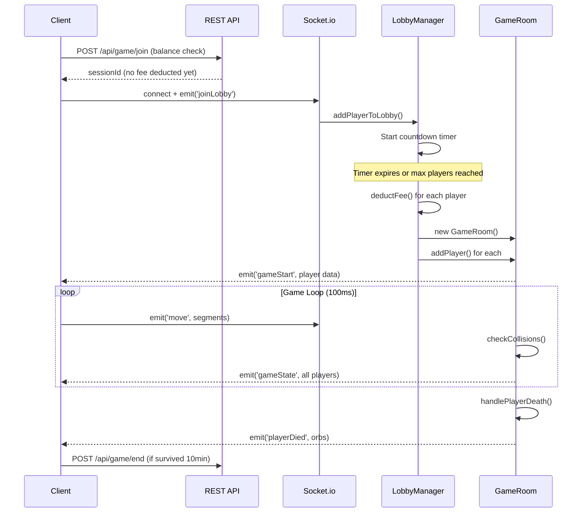
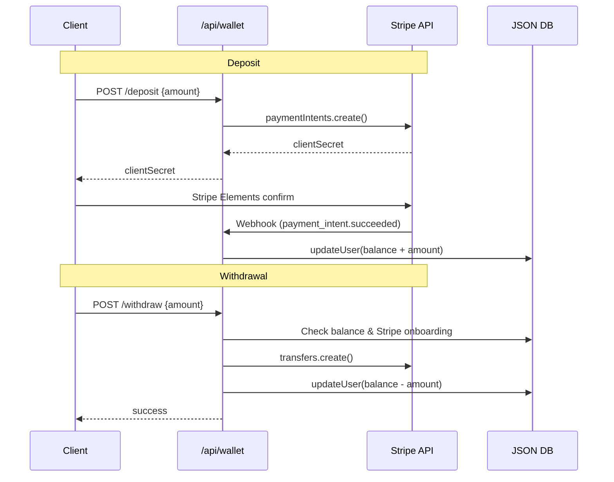

# Snaked! Architecture

A multiplayer snake game with real-money economy built on modern web technologies.



---

## Tech Stack

| Layer | Technology | Purpose |
|-------|------------|---------|
| Frontend | React 18 + Vite | SPA with fast HMR |
| Routing | React Router v6 | Client-side navigation |
| Real-Time | Socket.io | Multiplayer game state sync |
| Styling | Vanilla CSS | Custom game UI |
| Backend | Express.js | REST API server |
| Auth | JWT + bcrypt | Stateless authentication |
| Payments | Stripe Connect | Deposits, withdrawals, onboarding |
| Storage | JSON files | User data, transactions, sessions |

---

## Directory Structure

```
Snaked/
├── client/                    # React Frontend
│   ├── src/
│   │   ├── components/        # Reusable UI components
│   │   │   └── Layout/        # Navbar, etc.
│   │   ├── context/           # React Context (Auth)
│   │   ├── pages/             # Route components
│   │   │   ├── Game.jsx       # Main game canvas + logic
│   │   │   ├── Wallet.jsx     # Deposits/withdrawals
│   │   │   ├── Dashboard.jsx  # Player stats
│   │   │   └── Admin.jsx      # Admin panel
│   │   └── styles/            # Global CSS
│   └── vite.config.js
│
├── server/                    # Node.js Backend
│   ├── routes/
│   │   ├── auth.js            # Login/register/me
│   │   ├── wallet.js          # Balance/deposit/withdraw
│   │   ├── game.js            # Join/end/stats
│   │   └── admin.js           # Admin operations
│   ├── socket/
│   │   ├── gameHandler.js     # Socket.io setup
│   │   ├── LobbyManager.js    # Matchmaking + queue
│   │   └── GameRoom.js        # Game instance logic
│   ├── middleware/
│   │   └── auth.js            # JWT verification
│   ├── db/
│   │   ├── index.js           # Data access layer
│   │   └── data/              # JSON persistence files
│   └── utils/
│       └── stripe.js          # Stripe client wrapper
│
└── README.md
```

---

## Data Flow

### Authentication Flow



### Game Flow



### Payment Flow



---

## Core Components

### LobbyManager

Manages matchmaking queue with configurable parameters:
- `MAX_PLAYERS`: 50 players per game
- `LOBBY_TIMER_SECONDS`: 60 second countdown
- Requires 2+ players to start
- Deducts fees only when game actually starts

### GameRoom

Handles real-time game instance:
- `WORLD_SIZE`: 4000x4000 game world
- `FOOD_COUNT`: 300 food items maintained
- Game loop broadcasts state every 100ms
- Server-authoritative collision detection
- Money orbs dropped on player death

### Client Game (Game.jsx)

Single 800-line component handling:
- Canvas rendering with camera following player
- Local movement prediction with server sync
- Delta-time based movement for consistent speed
- Boost mechanic (click to speed up, loses segments)

---

## Potential Issues & Solutions

### 1. JSON File Storage Scalability

**Issue**: Current storage uses synchronous JSON file writes for every data change. This creates:
- Performance bottleneck under load
- Risk of data corruption on concurrent writes
- No transaction support

**Solutions**:
| Approach | Effort | Scalability |
|----------|--------|-------------|
| Add write queue/debouncing | Low | Medium |
| Migrate to SQLite | Medium | Good |
| Migrate to PostgreSQL (pg already installed) | Medium | Excellent |

```javascript
// Current (risky)
fs.writeFileSync(USERS_FILE, JSON.stringify(data, null, 2))

// Recommended: Batch writes
const writeQueue = []
setInterval(() => {
    if (writeQueue.length) flushToDisk()
}, 1000)
```

---

### 2. Client-Authoritative Movement

**Issue**: Server trusts client segment positions (`data.segments`), enabling cheating:
```javascript
// GameRoom.js line 140-142
if (data.segments && data.segments.length > 0) {
    player.segments = data.segments  // ⚠️ Direct override
}
```

**Solutions**:
1. **Server-authoritative movement**: Server calculates all positions, client only sends direction input
2. **Validation layer**: Reject suspicious movements (teleporting, impossible speeds)
3. **Hybrid approach**: Client predicts, server validates and corrects

```javascript
// Recommended validation
const MAX_MOVE_DISTANCE = NORMAL_SPEED * BOOST_SPEED_MULTIPLIER * 2
const headDelta = distance(player.segments[0], data.segments[0])
if (headDelta > MAX_MOVE_DISTANCE) {
    console.warn(`Suspicious movement from ${player.username}`)
    return // Reject update
}
```

---

### 3. Memory Leaks in GameRoom

**Issue**: Inactive game rooms may not be cleaned up, and player death cleanup uses `setTimeout`:
```javascript
// GameRoom.js line 176-178
setTimeout(() => {
    this.players.delete(player.id)  // ⚠️ Room reference may persist
}, 2000)
```

**Solutions**:
- Track active rooms in LobbyManager and cleanup when empty
- Use WeakMap for player references or clear timeout on disconnect
- Add room TTL (time-to-live) mechanism

```javascript
// In LobbyManager - add room cleanup
if (room.players.size === 0) {
    room.stop()
    this.activeGames.delete(roomId)
    console.log(`Room ${roomId} cleaned up`)
}
```

---

### 4. Race Condition: Fee Deduction

**Issue**: Balance check happens at `/join`, but fee deduction at game start creates a window for double-spending:

```
Player joins lobby (balance: $1.00, fee: $0.50)
  ↓ (60 second delay)
Player opens new tab, joins another lobby
  ↓
Both games start → Both try to deduct $0.50
```

**Solution**: Use optimistic locking or pending balance:

```javascript
// Add to user object
pendingFees: 0

// On join
user.pendingFees += GAME_FEE
if (user.balance - user.pendingFees < 0) {
    return res.status(400).json({ message: 'Insufficient balance' })
}

// On game start
user.balance -= GAME_FEE
user.pendingFees -= GAME_FEE
```

---

### 5. Large Game State Broadcasting

**Issue**: Full game state (all players, all food, all orbs) sent every 100ms:
```javascript
// GameRoom.js line 300-306
this.io.to(this.roomId).emit('gameState', {
    players: playersObject,      // Up to 50 players × segments
    food: this.food,             // 300 items
    moneyOrbs: this.moneyOrbs,   // Variable
    ...
})
```

**Solutions**:
1. **Delta updates**: Only send changes since last tick
2. **Spatial partitioning**: Only send nearby objects to each player
3. **Compression**: Use msgpack instead of JSON
4. **Reduce tick rate** for non-critical data (leaderboard, food)

```javascript
// Optimize: Send food only on changes
if (this.foodChanged) {
    this.io.to(this.roomId).emit('foodUpdate', this.food)
    this.foodChanged = false
}
```

---

### 6. Missing Error Boundaries

**Issue**: Game.jsx is a single 800-line component with no error boundaries. Canvas errors crash entire app.

**Solution**: Wrap game in error boundary, split into smaller components:

```javascript
// Recommended structure
Game/
├── GameCanvas.jsx      # Rendering only
├── GameHUD.jsx         # UI overlay
├── GameLobby.jsx       # Pre-game screen
├── useGameSocket.js    # Socket logic hook
└── useGameLoop.js      # RAF loop hook
```

---

### 7. Hardcoded Game Constants

**Issue**: Constants duplicated across client and server:
```javascript
// Client (Game.jsx)
const GAME_FEE = 0.5
const WORLD_SIZE = 4000

// Server (GameRoom.js)
const GAME_FEE = parseFloat(process.env.GAME_FEE) || 0.5
const WORLD_SIZE = 4000
```

**Solution**: Create shared constants endpoint:
```javascript
// GET /api/game/config
res.json({
    GAME_FEE,
    WORLD_SIZE,
    MIN_PLAY_TIME_MINUTES,
    ...
})
```

---

### 8. No Rate Limiting

**Issue**: API endpoints lack rate limiting, vulnerable to:
- Brute force login attempts
- Deposit/withdrawal spam
- Socket event flooding

**Solution**: Add express-rate-limit and socket throttling:

```javascript
import rateLimit from 'express-rate-limit'

const authLimiter = rateLimit({
    windowMs: 15 * 60 * 1000,  // 15 minutes
    max: 5,                     // 5 attempts
    message: 'Too many login attempts'
})

app.use('/api/auth/login', authLimiter)
```

---

### 9. Webhook Security

**Issue**: Stripe webhook endpoint may be exposed without proper validation in development:
```javascript
// If STRIPE_WEBHOOK_SECRET is not set
event = stripeClient.webhooks.constructEvent(req.body, sig, webhookSecret)
// ↑ Will fail silently or allow unverified events
```

**Solution**: Fail loudly if webhook secret is missing in production:
```javascript
if (!webhookSecret && process.env.NODE_ENV === 'production') {
    throw new Error('STRIPE_WEBHOOK_SECRET required in production')
}
```

---

### 10. Missing Database Indices/Optimization

**Issue**: User lookups by email iterate through all users:
```javascript
// db/index.js
export async function getUserByEmail(email) {
    for (const user of users.values()) {  // O(n) scan
        if (user.email === email) return user
    }
}
```

**Solution**: Add secondary index or migrate to proper database:
```javascript
// Add email index
const emailIndex = new Map()

export async function createUser(userData) {
    users.set(userData.id, userData)
    emailIndex.set(userData.email, userData.id)  // Index
    saveUsers()
}

export async function getUserByEmail(email) {
    const id = emailIndex.get(email)
    return id ? users.get(id) : null  // O(1)
}
```

---

## Priority Recommendations

| Priority | Issue | Impact | Effort |
|----------|-------|--------|--------|
| 🔴 High | Client-authoritative movement | Security | Medium |
| 🔴 High | Race condition on fees | Financial | Low |
| 🟡 Medium | JSON storage scalability | Performance | Medium |
| 🟡 Medium | Rate limiting | Security | Low |
| 🟡 Medium | Large state broadcasts | Performance | Medium |
| 🟢 Low | Game.jsx refactoring | Maintainability | High |
| 🟢 Low | Shared constants | DX | Low |

---

## Environment Configuration

### Server (`server/.env`)
```env
PORT=3001
JWT_SECRET=<random-secret>
STRIPE_SECRET_KEY=sk_test_...
STRIPE_WEBHOOK_SECRET=whsec_...
CLIENT_URL=http://localhost:5173
GAME_FEE=0.5
MIN_PLAY_TIME_MINUTES=10
```

### Client (`client/.env`)
```env
VITE_API_URL=http://localhost:3001
VITE_STRIPE_PUBLISHABLE_KEY=pk_test_...
```

---

## Deployment Notes

- **Frontend**: Built with Vite, deployable to Cloudflare Pages
- **Backend**: Standard Node.js, deployable to Render/Railway/Fly.io
- **CORS**: Configured for `.pages.dev` preview URLs
- **Socket.io**: Requires sticky sessions or Redis adapter for horizontal scaling
