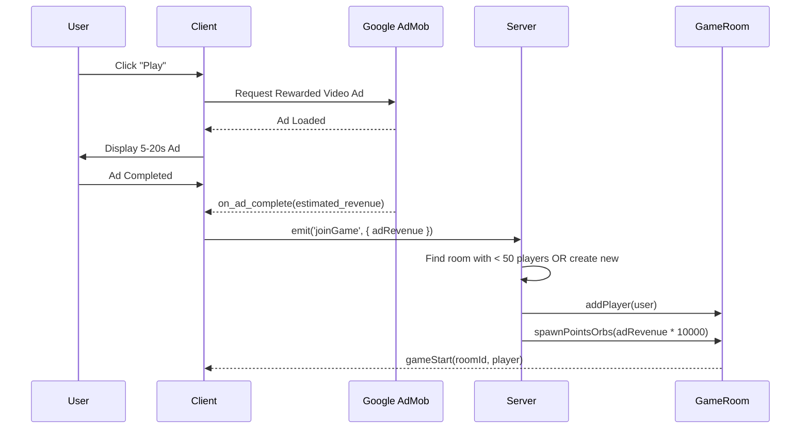

# Snaked! Refactor Plan: Ad-Based Monetization

## Overview

This refactor converts the game from a real-money gambling model to an **ad-supported free-to-play** model. Players watch ads to enter, and the ad revenue generated is distributed as collectible game points.

---

## New Game Flow



---

## Key Changes

| Area | Before | After |
|------|--------|-------|
| Monetization | Stripe deposits, game fees | Google AdMob rewarded ads |
| Currency | Real USD ($) | Game Points (100 pts = €0.01) |
| Lobby | 60s countdown, max 50 | Instant join, find/create room |
| Wallet | Full deposit/withdraw | **REMOVED** |
| Death | Drop orbs at location | 50% local, 30% random, 20% lost |
| HUD | $ balance | Points & player labels |

---

## Proposed Changes

### Client

#### [NEW] [AdService.js](file:///Users/ctw03023/Desktop/Snaked/client/src/services/AdService.js)
- Google AdMob / AdSense integration
- `loadRewardedAd()`, `showRewardedAd()`, `onAdComplete(callback)`
- Handle ad errors gracefully

#### [Game.jsx](file:///Users/ctw03023/Desktop/Snaked/client/src/pages/Game.jsx)
- Remove lobby waiting state
- Add pre-game ad screen: "Watch ad to play"
- On ad complete → `socket.emit('joinGame', { adRevenue })`
- Render player name + points above snake head
- Replace `$` displays with `pts`

#### [DELETE] Wallet.jsx
- Remove entire wallet page

#### [Navbar.jsx](file:///Users/ctw03023/Desktop/Snaked/client/src/components/Layout/Navbar.jsx)
- Remove "Wallet" link
- Show accumulated points instead of balance (optional)

---

### Server

#### [LobbyManager.js](file:///Users/ctw03023/Desktop/Snaked/server/socket/LobbyManager.js)
- Remove lobby timer and waiting queue
- Implement `findOrCreateRoom()`:
  ```javascript
  findOrCreateRoom() {
      for (const [id, room] of this.activeGames) {
          if (room.players.size < 50) return room
      }
      // Create new room
      const roomId = uuidv4()
      const room = new GameRoom(roomId, this.io)
      this.activeGames.set(roomId, room)
      room.startGameLoop()
      return room
  }
  ```
- On `joinGame` event: validate ad revenue, spawn orbs, add player

#### [GameRoom.js](file:///Users/ctw03023/Desktop/Snaked/server/socket/GameRoom.js)
- **Remove**: GAME_FEE, money references
- **Add**: `spawnPointsOrbs(points)` - distribute orbs randomly
- **Change**: Player death distribution:
  ```javascript
  handlePlayerDeath(player) {
      const total = player.points
      const localDrop = total * 0.50
      const randomDrop = total * 0.30
      // 20% is lost forever
      
      this.spawnOrbsAt(player.segments[0], localDrop)
      this.spawnOrbsRandom(randomDrop)
  }
  ```
- **Add**: Include `username` and `points` in player broadcast data

#### [DELETE] routes/wallet.js
- Remove entire wallet routes file

#### [DELETE] utils/stripe.js
- Remove Stripe integration

#### [auth.js](file:///Users/ctw03023/Desktop/Snaked/server/routes/auth.js)
- Remove balance field from user creation
- Add `totalPointsEarned` field for stats

#### [db/index.js](file:///Users/ctw03023/Desktop/Snaked/server/db/index.js)
- Remove transaction-related functions
- Remove balance tracking
- Keep user accounts for login/stats

---

## Google Ads Integration

### Option 1: Google AdMob (Recommended for Mobile/WebView)
```html
<!-- In index.html -->
<script async src="https://pagead2.googlesyndication.com/pagead/js/adsbygoogle.js?client=ca-pub-XXXXXXX" crossorigin="anonymous"></script>
```

### Option 2: Google Ad Manager (Rewarded Video Web)
- Use Google IMA SDK for rewarded video ads
- Estimated revenue per view: $0.001 - $0.02

### AdService.js Skeleton
```javascript
export class AdService {
    constructor() {
        this.adUnitId = import.meta.env.VITE_AD_UNIT_ID
    }

    async loadRewardedAd() {
        // Load ad from Google
    }

    async showRewardedAd() {
        return new Promise((resolve, reject) => {
            // Show fullscreen ad
            // On complete: resolve({ estimatedRevenue: 0.005 })
            // On skip/error: reject()
        })
    }
}
```

---

## Points System

| Ad Revenue | Game Points |
|------------|-------------|
| €0.001 | 10 pts |
| €0.005 | 50 pts |
| €0.01 | 100 pts |
| €0.02 | 200 pts |

**Conversion**: `points = adRevenue * 10000` (since 100 pts = €0.01)

---

## Death Distribution Example

Player dies with **1000 points**:
- **500 pts** (50%) → Orbs dropped at death location
- **300 pts** (30%) → Orbs spawned randomly across room
- **200 pts** (20%) → Lost forever (game economy sink)

---

## UI Mockup: Player Labels

```
     [PlayerName]
       1,234 pts
          🐍
       ○○○○○○
```

---

## Files to Delete

1. `/client/src/pages/Wallet.jsx`
2. `/server/routes/wallet.js`
3. `/server/utils/stripe.js`

---

## Environment Variables

### Client (.env)
```env
VITE_API_URL=http://localhost:3001
VITE_AD_UNIT_ID=ca-app-pub-XXXXXXX/YYYYYYY
```

### Server (.env)
```env
PORT=3001
JWT_SECRET=<secret>
# Remove all STRIPE_* variables
```

---

## Migration Steps

1. **Phase 1: Remove Stripe**
   - Delete wallet routes and Stripe utils
   - Remove balance from user model
   - Update client to remove wallet page

2. **Phase 2: Implement Instant Join**
   - Refactor LobbyManager to find/create rooms
   - Remove lobby timer and waiting state

3. **Phase 3: Add Google Ads**
   - Create AdService
   - Add pre-game ad screen
   - Convert ad revenue to points

4. **Phase 4: Update Game Logic**
   - Implement new death distribution
   - Add player labels (name + points)
   - Replace $ with pts everywhere

---

## Verification Plan

1. **Ad Integration**: Mock ad service returns revenue → points spawn in room
2. **Room Joining**: Rapid joins fill room → new room created at 50
3. **Death Mechanics**: Kill player → verify 50/30/20 distribution
4. **UI**: Player labels visible above all snakes
